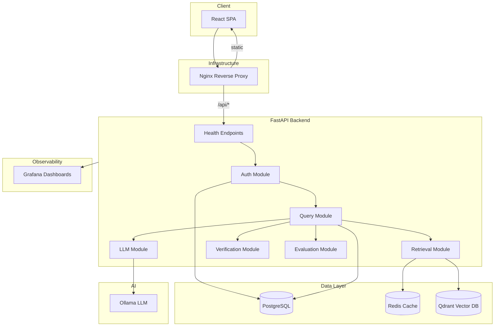

# NyayaML v3.1

**AI-powered Indian legal research platform** — modular monolith architecture with hybrid retrieval, structured LLM responses, and multi-act verification.

> 🚧 **Status: Phase 0 — Foundation** · Infrastructure, health endpoints, CI. Zero AI logic yet.

---

## Quick Start

```bash
# 1. Clone and configure
cp .env.example .env

# 2. Launch all 7 services
make up

# 3. Verify health
curl http://localhost/api/v1/health
# → {"status": "ok"}

curl http://localhost/api/v1/health/ready
# → {"status": "ready", "services": {...}}
```

## Architecture



## Services

| Service   | Port | Purpose                          |
|-----------|------|----------------------------------|
| nginx     | 80   | Reverse proxy, serves frontend   |
| backend   | 8000 | FastAPI modular monolith         |
| postgres  | 5432 | Relational data (users, queries) |
| redis     | 6379 | Caching, rate limiting           |
| qdrant    | 6333 | Vector similarity search         |
| ollama    | 11434| Local LLM inference              |
| grafana   | 3000 | Monitoring dashboards            |

## Make Targets

```bash
make up        # Start all services
make down      # Stop and remove volumes
make logs      # Follow service logs
make test      # Run test suite
make lint      # Run ruff linter
make rebuild   # Rebuild without cache
make shell     # Shell into backend
make migrate   # Run database migrations
```

## Documentation

- [Architecture](docs/architecture.md)
- [API Specification](docs/api-spec.md)
- [System Design](docs/system-design.md)

## License

Private — All rights reserved.
